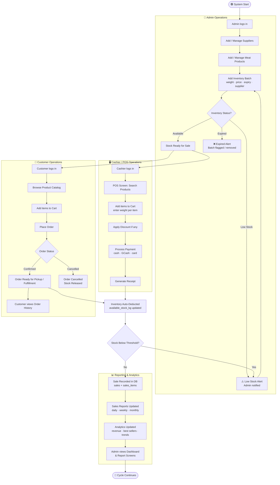
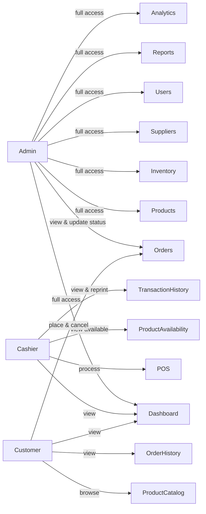
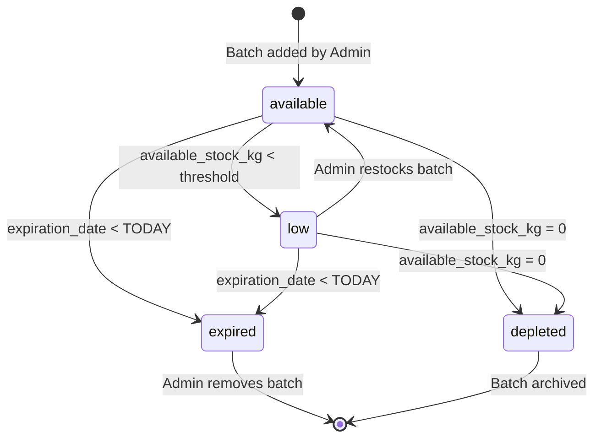
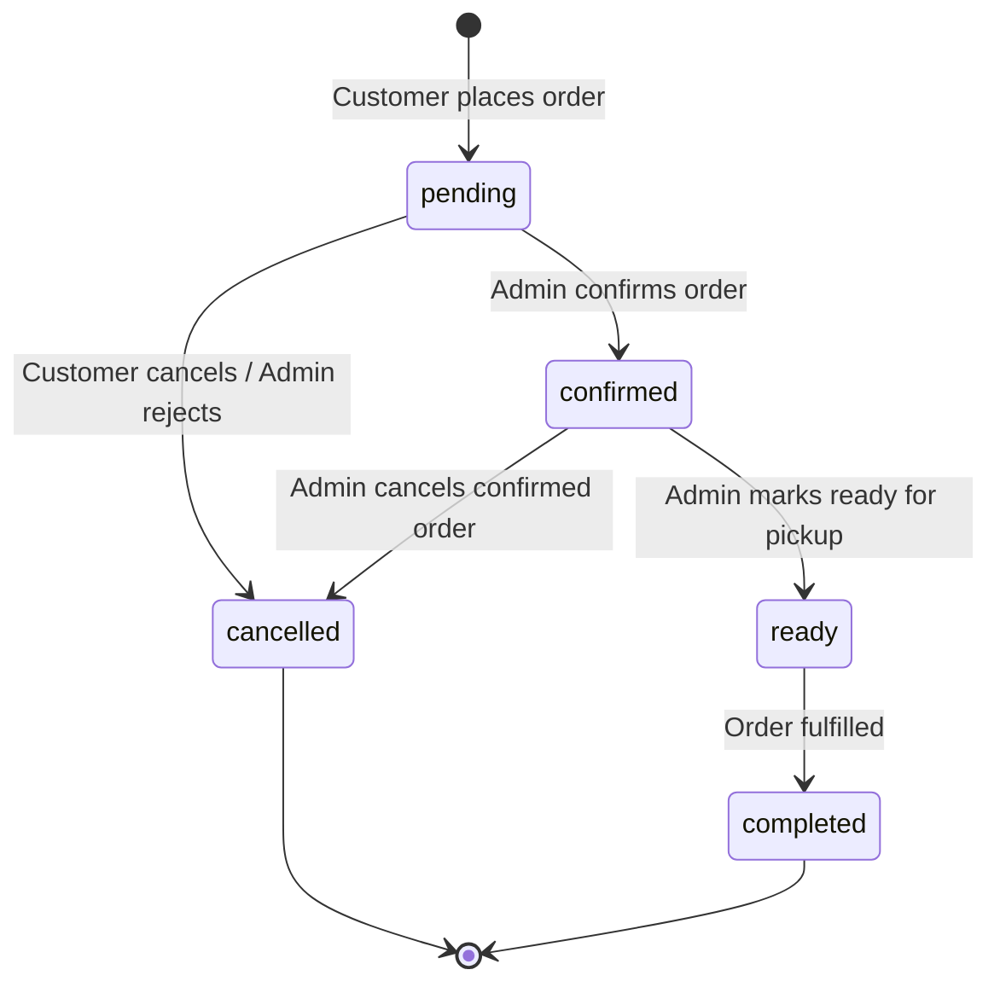

# System Workflow
## Slaughterhouse Meat Inventory and Sales Management System (SMIS)

---

## End-to-End Operational Flow

---

## Role-Based Access Summary

---

## Inventory State Machine

---

## Order Lifecycle

